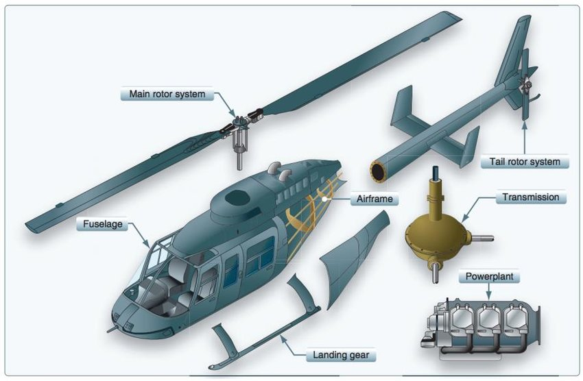

# Robust Multivariable Control of a High-Order Helicopter System


[](LICENSE)

A refactored MATLAB project for **MIMO interaction analysis, baseline control, mixed-sensitivity H-infinity synthesis, structured uncertainty modeling, robust-stability/performance verification, and optional mu synthesis** on a 10-output / 4-input helicopter model developed in the context of multivariable-control coursework at Amirkabir University of Technology (AUT).

<p align="center">
  
</p>

> **Scientific scope.** The 40 transfer-function channels are source-derived from the original repository. The original project does not document physical channel names/units or enough provenance to resolve one suspicious denominator coefficient. This refactor preserves the legacy model by default and makes every unresolved assumption explicit instead of silently inventing metadata.

## What is stronger in v2

- one authoritative 10x4 plant builder instead of duplicated coefficient blocks;
- explicit handling of the unresolved `G(3,2)` coefficient `87338` versus the neighboring common value `8733`;
- automatic structural validation;
- reproducible output-subset selection for demonstration when physical controlled outputs are not yet documented;
- DC Relative Gain Array (RGA), pairing, and Niederlinski Index analysis;
- singular-value and frequency-dependent conditioning analysis;
- regression fix for the original scripts' **first-three-singular-values-only** maximum calculation;
- RGA-paired decentralized PI baseline;
- LQI full-state benchmark;
- mixed-sensitivity H-infinity controller with `mixsyn`;
- output-multiplicative dynamic uncertainty using `ultidyn`;
- structured robust-stability analysis using `robstab`;
- robust-performance analysis using `robgain` and `wcgain`;
- structured singular-value bounds using `lftdata` + `mussv`;
- optional D-K iteration / mu synthesis using `musyn`;
- worst-case uncertain-model extraction and simulation;
- MATLAB unit tests and GitHub Actions CI;
- source-driven figure generation instead of relying on old binary `.fig` files;
- full documentation for theory, model provenance, architecture and reproducibility.

## Important model-provenance issue

The original scripts define the denominator of `G(3,2)` with

```matlab
... + 1.426e04*s^4 + 87338*s^3 + 5415*s^2 + ...
```

while the matching common denominator used by neighboring channels contains `8733*s^3`. The repository itself does not prove which number is physically correct.

Therefore:

```matlab
G = buildHelicopterPlant("Variant","legacy");
```

uses **87338** exactly as the original source does, while

```matlab
G = buildHelicopterPlant("Variant","consistent-denominator");
```

provides a clearly labeled sensitivity-analysis candidate using **8733**. See [`docs/MODEL_PROVENANCE.md`](docs/MODEL_PROVENANCE.md).

## Mathematical structure

The nominal model is

$$
G(s) \in \mathbb{R}^{10\times4}.
$$

Because the physical meanings of the ten outputs are absent from the original repository, the demo pipeline can choose four outputs numerically to obtain a square controlled subplant

$$
G_c(s)\in\mathbb{R}^{4\times4}.
$$

This choice is for reproducibility only; it should be replaced by physically justified controlled outputs when the original helicopter channel definitions are recovered.

### MIMO interaction analysis

The project evaluates the Relative Gain Array

$$
\Lambda = G_c(0)\circ G_c(0)^{-T},
$$

The selected decentralized pairing is also screened using the steady-state Niederlinski Index as a classical warning test. A negative NI is a warning for integral decentralized control; a positive NI is not by itself a stability guarantee.

The singular-value condition number is

$$
\kappa(\omega)=
\frac{\bar\sigma(G_c(j\omega))}{\underline\sigma(G_c(j\omega))}.
$$

### Mixed-sensitivity H-infinity design

For $L=G_cK$,

$$
S=(I+L)^{-1},\qquad T=L(I+L)^{-1},
$$

and the H-infinity design minimizes

$$
\left\|
\begin{bmatrix}
W_S S\\
W_U KS\\
W_T T
\end{bmatrix}
\right\|_\infty.
$$

### Structured uncertainty

The default demonstrator uses

$$
G_\Delta=(I+W_\Delta\Delta_y)G_c,
\qquad \|\Delta_y\|_\infty\le1.
$$

The weight is illustrative until experimental model-validation data are available.

## Quick start

### Requirements

- MATLAB R2021a or newer recommended;
- Control System Toolbox;
- Robust Control Toolbox.

Simulink is **not required** by the refactored core analysis.

```matlab
setupProject
run("examples/run_nominal_analysis.m")
run("examples/run_controller_comparison.m")
run("examples/run_robustness_analysis.m")
```

Optional D-K iteration:

```matlab
run("examples/run_mu_synthesis.m")
```

Compare the unresolved model coefficient without declaring either value correct:

```matlab
run("examples/run_model_variant_comparison.m")
```

## Controller portfolio

| Controller | Purpose | Handles MIMO interaction explicitly? | Robust synthesis? |
|---|---|---:|---:|
| RGA-paired decentralized PI | interpretable baseline | Limited | No |
| LQI | full-state integral benchmark | Yes | No |
| Mixed-sensitivity H-infinity | nominal robust-control design | Yes | Yes, via weighted induced norm |
| Mu synthesis | structured-uncertainty D-K iteration | Yes | Yes, structured |

The LQI implementation uses a state-space realization of the transfer matrix. Those states are realization coordinates, not documented physical helicopter states, so LQI is presented as a simulation benchmark rather than a directly deployable controller.

## Robust verification

The project does **not** call a nominal singular-value plot a complete robust-stability proof. Instead it provides:

- `robstab` for structured robust-stability margin;
- `robgain` for weighted robust-performance margin;
- `wcgain` for worst-case gain and uncertainty;
- `mussv` for structured singular-value bounds when an M-Delta LFT is available.

## Repository structure

```text
AUT-Multivariable-control-HelicopterSystem/
├── .github/workflows/matlab-ci.yml
├── assets/
│   └── HelicopterParts.jpg
├── docs/
│   ├── ARCHITECTURE.md
│   ├── MATHEMATICAL_MODEL.md
│   ├── MODEL_PROVENANCE.md
│   ├── RESULTS.md
│   └── ROBUST_CONTROL_THEORY.md
├── examples/
│   ├── run_all.m
│   ├── run_controller_comparison.m
│   ├── run_model_variant_comparison.m
│   ├── run_mu_synthesis.m
│   ├── run_nominal_analysis.m
│   └── run_robustness_analysis.m
├── legacy/
│   ├── MFILE_Design.m
│   ├── RobustPerformance.m
│   └── RobustStability.m
├── results/
├── src/
│   ├── analysis/
│   ├── controllers/
│   ├── models/
│   ├── robustness/
│   └── utils/
├── tests/
├── CHANGELOG.md
├── CITATION.cff
├── CONTRIBUTING.md
├── LICENSE
├── MIGRATION.md
├── REFERENCES.bib
├── ROADMAP.md
├── README.md
└── setupProject.m
```

## Run the tests

From MATLAB:

```matlab
setupProject
results = runtests("tests");
assertSuccess(results)
```

The GitHub workflow uses the official MathWorks MATLAB Actions and installs Control System Toolbox and Robust Control Toolbox before running the tests.

## Limitations

This repository is an educational/research software refactor, not a flight-control certification artifact. In particular:

- the original input/output channel meanings and units are not available in the repository;
- the plant coefficient anomaly must be verified from the original model source;
- the uncertainty weight is illustrative rather than experimentally identified;
- actuator limits, sensor dynamics, delays, nonlinear rotor aerodynamics and flight-envelope scheduling are not modeled unless added explicitly;
- H-infinity and mu synthesis results depend strongly on the chosen controlled outputs and weights.

## References

See [`REFERENCES.bib`](REFERENCES.bib). Recommended background includes Skogestad & Postlethwaite's *Multivariable Feedback Control* and Zhou, Doyle & Glover's *Robust and Optimal Control*.

## License

MIT. See [`LICENSE`](LICENSE).

## Communication & Interaction

Questions, feedback, bug reports, and ideas for extending the project are welcome.

- **Open an issue** for bugs, questions, or feature requests.
- **Pull requests** are welcome.
- **Email:** saeedaghamohammadi99@gmail.com for collaboration or research-related questions.

If this project was useful or interesting, a star on the repository is appreciated.

